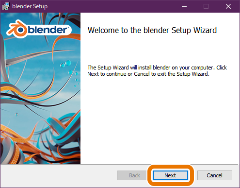
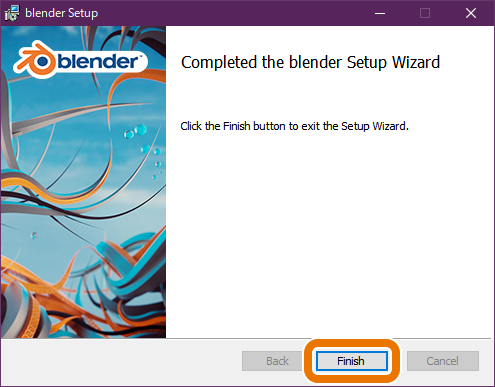

# Blenderのインストール手順

Blenderのインストール手順を紹介します。以下に従い、**インストール**と**日本語化**を行ってください。

なお、本ページではバージョン**2.92.0**を利用して説明しています。現在リリースされている最新版は<blenderVersion />であり、以下の説明とは一部ファイル名等が異なりますが、大まかな流れは同じです。

[[TOC]]

## インストール手順

### Windowsでの手順

1. <https://www.blender.org/download/>にアクセスし、「Download Blender 2.XX.X」のボタンをクリックして`blender-2.XX.0-windows64.msi`(バージョンによってファイル名が変わります)を適当な場所にダウンロードしてください。ダウンロード場所はデスクトップなどどこでもOK。

2. ダウンロードした`blender-2.XX.X-windows64.msi`をダブルクリックしてインストールを開始します。以下のウィンドウが立ち上がるので"Next"をクリック。

3. 使用許諾契約が表示されます。同意しないとBlenderが使えないのでチェックボックスにチェックを入れて"Next"をクリック。

4. Custom Setupが表示されます。インストール内容のカスタムは不要なのでウィンドウ中央に表示されるツリー部分は触らないでください。誤クリック等で設定が変わってしまったら下の"Reset"をクリック。デフォルトでは`C:\Program Files\Blender Foundation\Blender 2.XX`にインストールされます。インストール場所を変えたい場合は画像内点線で囲った"Browse..."をクリックしてインストールしたいフォルダを選択してください。インストールには約550MBの空き容量が必要です。インストール場所の設定をしたら"Next"をクリック。

5. 以下の画像が表示されたらインストール準備は完了。"Install"をクリックするとインストールが開始されます。

6. ユーザーアカウント制御が表示されるので"はい"をクリック。

7. インストールが進行します。数分で完了します。

8. 下の画面が表示されたらインストール完了です。"Finish"をクリックしてウィザードを閉じてください。

9. デスクトップにBlenderのショートカットが作られているはず。ダブルクリックでBlenderを起動できます。

### Macでの手順

::: danger ToDo
追記する(Mac持ってる人に画像提供してもらう?)
:::

## 日本語化手順

必須の操作ではありませんが、初心者の方は日本語化することをおすすめします。

1. インストールしたBlenderを起動してください。デフォルトではBlenderを起動すると以下のような画面になります。中央に出ているウインドウは**スプラッシュ画面**です。**スプラッシュ画面の外側の領域をクリックしてスプラッシュ画面を消してください。**

  :::warning
  最初に起動した場合はスプラッシュ画面からも日本語化設定が可能ですが、誤クリック等で"Shortcuts"や"Select with"を変更してしまう可能性があるのでスプラッシュ画面は消してしまいましょう。これらを変更してしまうと、**操作が大きく変わってしまいます**。ネット上の記事や書籍ではデフォルトの操作設定で解説されることが多いため、初心者が気づかずにこれらを変更してしまうと混乱を招く可能性があるので**触らないように**しましょう。
  :::

  
  ↓Quick Setupのデフォルト設定 どこも変更しないようにしましょう↓
  

2. 左上の"Edit"をクリックしてドロップダウンメニューを表示してください。最下部にある"Preferences..."をクリックすると設定ウィンドウを開くことができます。

3. Blenderの設定ウィンドウです。左列で設定のカテゴリを選択できます。言語設定は一番上の"Interface"内に存在するので"Interface"をクリックしてください。

4. "Translation"内の"Language"の右にあるメニューをクリックして言語一覧から"Japanese(日本語)"を選択してください。

5. **重要** 日本語の選択後、すぐ下の"影響"欄の3つのチェックボックスを確認しましょう。

- "ツールチップ"にチェックを入れると、各種UI要素上にマウスカーソルを重ねた時に表示される解説が翻訳される(**チェック推奨**)
- "インターフェイス"にチェックを入れるとすべてのラベルが翻訳される(**チェック推奨**、英語の資料を見ながら制作するとき等はチェックを外すと良い)
- **重要** "新規データ"にチェックを入れると新しく追加したデータブロックの名前が翻訳される。**チェックを付けないでください**

以下の画像のようになっていれば大丈夫です。

:::warning
"新規データ"にチェックを付けてしまうと、新しく追加したオブジェクト、マテリアル、シェイプキー、UVマップ、頂点グループ等々がすべて日本語名で生成されてしまいます。日本語データ、つまり2バイト文字を含むデータはエラーやトラブルの原因になる可能性が非常に高いので絶対にチェックを付けないようにしましょう。オブジェクト名などは自分で変更することが可能ですが、その際にも日本語の入力はしないようにしましょう。
:::

これでBlenderの日本語化は完了です。設定ウィンドウは閉じてOKです。
