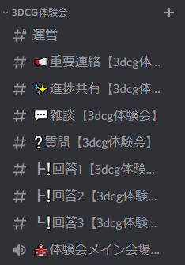

# 事前準備

本体験会の参加にあたり、まず必要な準備がいくつかあります。

[[TOC]]

## 資料

本体験会では資料として今ご覧いただいているページ(<https://d_etteiu8383.trap.show/modeling-trial/>)を使います。

## デバイス

**この体験会はPCでの参加を前提としています。スマートフォンやタブレットでは制作できません。**
ご注意ください。

この体験会で使用するソフトウェア(Blender)を快適に操作するために**最低限**必要なPCのスペックを以下に紹介します。

- CPU:2コア2Ghz以上
- メモリ:4GB以上
- ディスプレイ:1280x768以上の解像度
  - 解像度ももちろんですが、画面自体が大きい方が制作しやすいです
- 入力デバイス:**マウス**、トラックパッド、またはペンタブレット
- グラフィックカード：1GB以上(OpenGL3.3以上対応)

古いノートパソコンを利用している場合は少しスペックが厳しいかもしれませんが、近頃発売されているPCであれば(安いノートパソコンでも)基本的にこれらの条件は満たしているはずです。

また、ノートパソコンからの参加も問題ありませんが、**マウスの使用を強く推奨します**。3DCGの制作はその"3D"という特性上、画面の操作が比較的難しいです。トラックパッドでも操作できないことは無いですが、なるべくマウスを用意することをお勧めします。

真剣に3DCGに挑戦したい方は[Blender公式が提示している推奨スペック](https://www.blender.org/download/requirements/)を参考にしてPCを選ぶことをお勧めします。

## ソフトウェア

本体験会の実習では、**Blender**(ブレンダー)という**無料**の3DCG制作ソフトを用います。当日体験会中にもインストール手順を説明しますが、**事前にインストールを済ませておくとスムーズに参加できます**。時間に余裕がある方は、体験会前にインストールを済ませてください:pray:

具体的なインストール手順は[Blenderのインストール手順](blender-installation.md)(<https://d_etteiu8383.trap.show/modeling-trial/guide/blender-installation.html>)を確認してください。

なお、他の3Dモデリングソフトウェアを所有していて、そちらを使って作業したい人はインストールしなくても構いませんが、演習ではBlenderに準拠した説明を行うので、扱いに自身が無い人はBlenderのインストールを強く推奨します。

## Discord

本体験会は、**Discord**(<https://discord.com/>)というビデオ通話/チャットアプリを利用して開催します。

**こちらの[参加リンク](https://discord.gg/QGfFBXsr)(<https://discord.gg/QGfFBXsr>)からtraP新歓Discordサーバーに参加してください。**

当日はこのDiscordサーバー内の[🏫体験会メイン会場【3dcg体験会】](https://discord.com/channels/956885476986482730/966918632737210440)というボイスチャンネルにて講師が画面共有を行い、体験会を進めます。

当日の連絡等はこのDiscordサーバーの[📢重要連絡【3dcg体験会】](https://discord.com/channels/956885476986482730/966918874148798585)というテキストチャンネルで行います。

