# 3DCGはどう作るの？

:::tip 目標
3DCG制作の具体的な手順を知る。
:::

一般的な3DCG制作では大体下のような流れ。

1. [立体物を用意する](#_1-立体物を用意する)
2. [立体物を動かす](#_2-立体物を動かす)
3. [カメラやライト等の準備](#_3-カメラやライト等の準備)
4. [画像に変換する](#_4-画像に変換する)
5. [エフェクト等で調整](#_5-エフェクト等で調整)

## 1. 立体物を用意する

> コンピュータの演算によって3次元空間内の仮想的な立体物を2次元である平面上の情報に変換することで奥行き感（立体感）のある**画像を作る手法**
>
> (引用：<https://ja.wikipedia.org/wiki/3%E6%AC%A1%E5%85%83%E3%82%B3%E3%83%B3%E3%83%94%E3%83%A5%E3%83%BC%E3%82%BF%E3%82%B0%E3%83%A9%E3%83%95%E3%82%A3%E3%83%83%E3%82%AF%E3%82%B9>)

この定義における"3次元空間内の仮想的な立体物"のことを一般的に**3Dモデル**(3D model)と呼ぶ。
3Dモデルを作る過程を**モデリング**(modeling)と呼ぶ。

:::tip
本来"モデリング"と言う時は"立体物の作成過程"のみを指す。Vtuber等の流行で"モデリング"という単語が独り歩きしてる感あるけどモデリングは3DCGのほんの一部に過ぎない。
:::

3Dモデルの構成要素は大きく分けて**ポリゴンメッシュ**と**マテリアル**の二つ。

### ポリゴンメッシュ

3Dモデルの**形**は**ポリゴンメッシュ**(polygon mesh)で...つまり**多角形**の**網目**で表現される。
ポリゴンメッシュはさらに以下の3つの要素で構成される。

- **頂点**(Vertex)
  - 位置のデータ(3次元)を持つ点
- **辺**(Edge)
  - 2つの頂点間を結んだ線
- **面**(Face)
  - 3つ以上の辺で囲まれた多角形

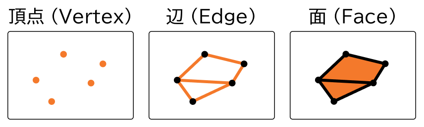

下図の黒い点が**頂点**、黒い線が**辺**、白い部分は**面**。

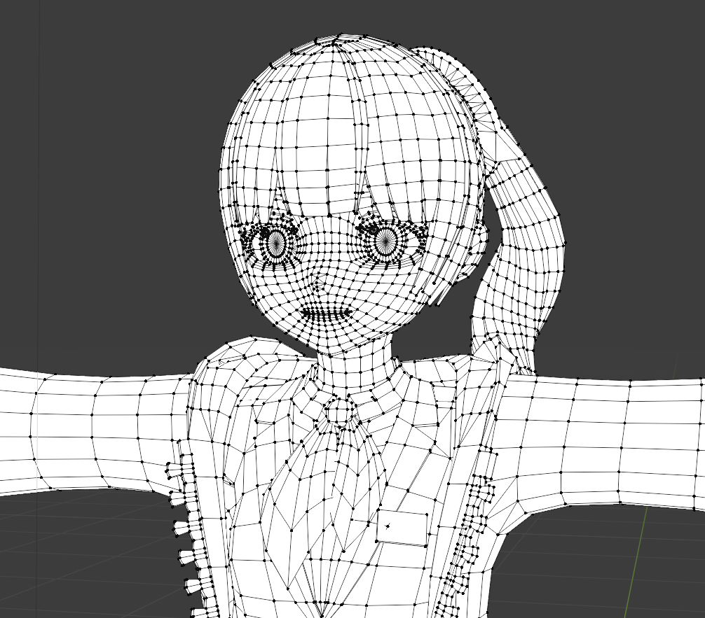

このように頂点や面を追加したり、
位置を調整してポリゴンメッシュを作るのが
モデリングの第一段階。

### マテリアル

3Dモデルの**材質**は**マテリアル**(material)によって規定されている。

マテリアルは、**材質に関する設定**をまとめたもの。

- **色**(アルベド/ベースカラー)
  - どんな光を反射するか?
- 表面の粗さ(ラフネス/スムースネス)
  - ざらざらか？つるつるか？
- 金属っぽさ(メタリック)

などの**描画に必要な情報**(と、
**シェーダー**)を内包している。

:::details シェーダーについて
**シェーダー**は各設定値を元に**描画色を計算するスクリプト**。今回の体験会ではシェーダーについては深く触れないが、

「"色(0.0, 0.9, 0.9), 粗さ0.5, メタリック0"という設定で、白い光がこっちの方から当たっているから反射を計算して...このピクセルの色は"(0.5, 1.0, 1.0)"だ！」

みたいな計算をしている。シェーダーについて詳しい話をしようとするとそれだけで講習会が5個ぐらい必要になるので、より詳しい話を知りたい方はググってください...

シェーダーは**がっつりプログラミング**の領域なので、「お絵描きはできないけどプログラミングできるのでこれで芸術作品作る」みたいな人もいっぱいいる→ "[#つぶやきGLSL](https://twitter.com/search?q=%23%E3%81%A4%E3%81%B6%E3%82%84%E3%81%8DGLSL&src=typed_query)"などでググるとおもしろい

ググりワード：シェーダー, 頂点シェーダ―, フラグメントシェーダー, GLSL
:::

下図はそれぞれ異なる設定を与えたマテリアルを、同じ球体の3Dモデルに適用した例。設定した値によって見た目が変化しているのがわかる。

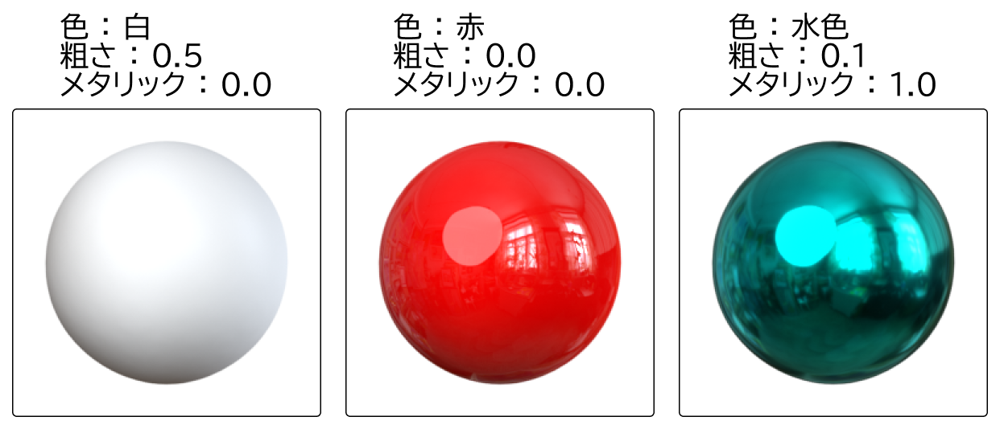

:::tip まとめ
3DCGで描画する"立体物"を**3Dモデル**と呼び、これを作成する作業を**3Dモデリング**と呼ぶ。
3Dモデルは主に**ポリゴンメッシュ**(形のデータ)と**マテリアル**(材質の設定)で構成される。
:::

## 2. 立体物を動かす

映像を作成する場合は、3Dモデルの位置や形状を時間に応じて変化させる(**アニメーション**させる)必要がある。アニメーションの設定では主に**キーフレームアニメーション**と**スケルタルアニメーション**という仕組みを用いる。

### フレーム

ここでは下図の様な、ボールを下方に移動させるアニメーションを作る場合を考える。

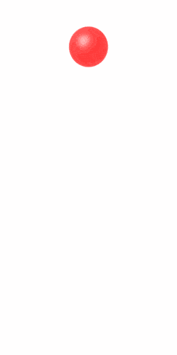

このようなアニメーションを作成する場合、ボールの位置を**少しずつずらした**複数の画像を用意し、これらを**素早く切り替えて表示する**ことで動いているように見せる。パラパラ漫画と同じ原理。

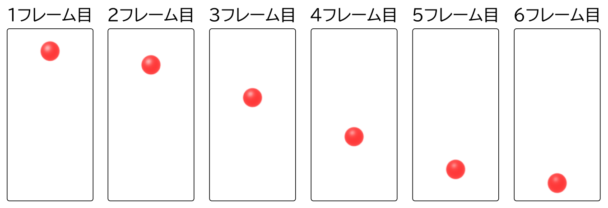

この1枚1枚の画像を**フレーム**と呼ぶ。

例えばTVアニメは1秒間に24枚の画像を素早く切り替えて表示することで動いているように見せている。これを"24fps(frame per second = フレーム毎秒)のアニメーション"と呼んだりする。

3DCGでもアニメと同様に、複数の画像を素早く切り替えることで動きを表現する。

しかし、すべてのフレームで3Dモデルの位置を設定するのはとても大変。30秒・24fpsの動画を作るだけでも30×24=720枚もの画像を作る必要があり、全てを手動で作成するのはめんどくさい。そこで、**キーフレームアニメーション**と呼ばれる手法を利用する。

### キーフレームアニメーション

**キーフレームアニメーション**は、**重要なフレームだけで**モノの動作を指定するアニメーション作成方法。

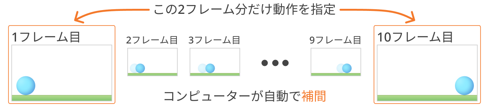

"1フレーム目ではボールをこっちに置く"、"10フレーム目ではボールをあっちに置く"
のように、2つの**重要なフレームだけで**モノの動作を指定する。
この重要なフレームを**キーフレーム**と呼ぶ。

2～9フレーム目でのボールの位置はエディタ/ツールがイイ感じに**補間**してくれる。
この仕組みが**キー**(Key(大事な))**フレーム**(だけ指定する)アニメーション。

:::details 補間の指定
補間は**アニメーションカーブ**(ファンクションカーブとも呼ばれる)で指定する。
時刻に対する状態(位置や回転、大きさなど)を曲線で指定して補間する。

| 滑らかな入り抜き | 直線的な移動 | ばねみたいな移動 |
| :-: | :-: | :-: |
| 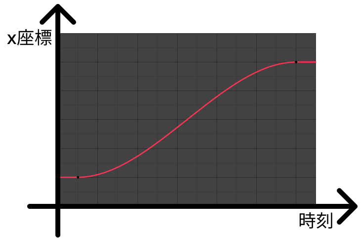 | 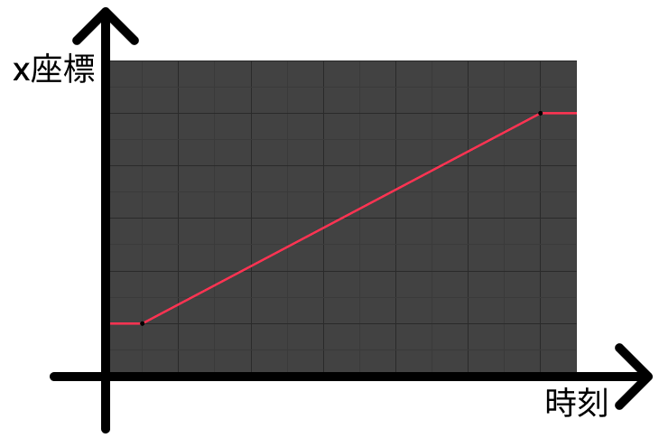 | 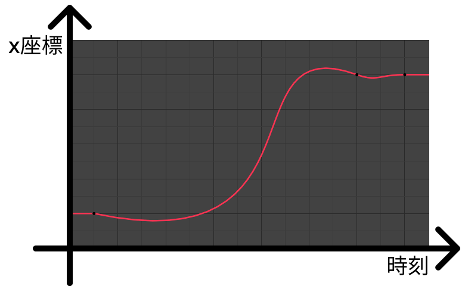 |
|  |  | 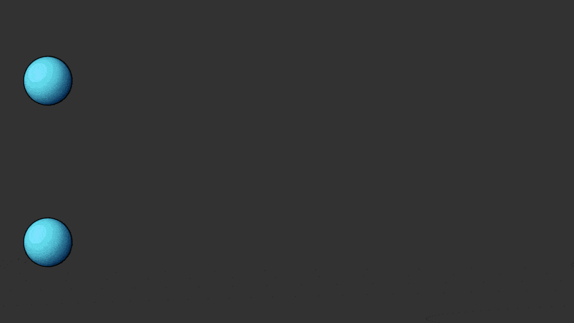 |
:::

### スケルタルアニメーション

アニメーションの制作過程では、モデルの位置や回転、大きさを変化させる以外にも、モデル自体を変形させたいことがある(というかほぼ確実に必要になる)。

ポリゴンメッシュの変形には主に**スケルトン**と**ブレンドシェイプ**が用いられる。ここではスケルトンによる変形手法である**スケルタルアニメーション**について説明する。

アニメーションさせるために、ポリゴンメッシュの頂点 1 つ 1 つの位置変化を細かく指定するのはめんどくさい。

**スケルトン**(skeleton)を用いると、人間や動物、ロボットアーム等、**関節**を持ったポリゴンメッシュを楽に、イイ感じに変形することができる。

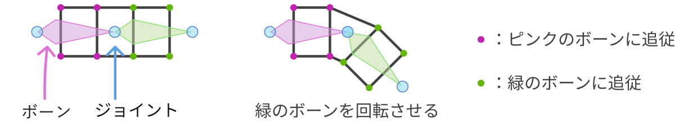

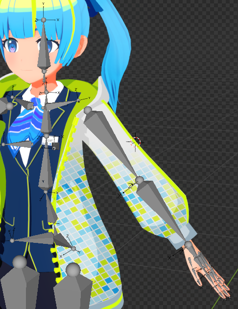

スケルトンは**ボーン**と**ジョイント**で構成された**骨格**のこと。このスケルトンとポリゴンメッシュを**連動させる**(**スキニング**する)ことで、ポリゴンメッシュを変形させることができる。

これと先ほどのキーフレームアニメーションを用いて、"1フレーム目では腕のボーンをこの角度に、10フレーム目では..."などと指定するとポリゴンメッシュの変形をアニメーションできる。

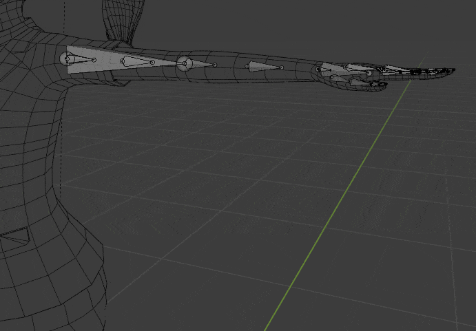

:::details スキニング時の調整
**スキンウェイト**は"どの頂点が","どのボーンに","どれぐらいの割合で"追従するかを決める**重み**のこと。実際にスキニングを行う際は各頂点のスキンウェイトを調整することで、変形の仕方を調整する。

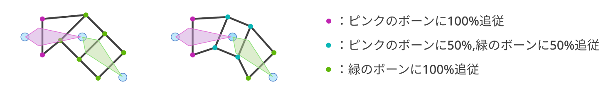

スキンウェイトを変更すると、ボーンの変形が同じでもモデルの変形の仕方が変化することがわかる。
:::

:::tip まとめ
3Dモデルを動かすことを**アニメーション**させると言い、アニメーションは**フレーム**毎に少しずつ画像を変化させることで表現する。

アニメーション作成では"大事なフレームでモデルの位置や回転を指定する"**キーフレームアニメーション**が主に利用され、モデルを変形させる場合は主に**スケルタルアニメーション**が利用される。
:::

## 3. カメラやライト等の準備

立体物の準備ができたら、それを撮影する**カメラ**と、それを照らす**ライト**を用意する。

3DCGにおいても、現実世界のカメラ、ライトと同様の機能を持つ仮想的なカメラ、ライトが登場する。

## 4. 画像に変換する

立体物とライトとカメラの情報から、**コンピューターがひたすら計算**して画像が完成する。

この過程を**レンダリング**(rendering)という。レンダリングは、その計算方法(アルゴリズム)によっていくつかの種類に分類される。計算方法により、「計算時間はかかるが高品質な画像を生成できるレンダリング」「画像の品質は低いが、計算時間が非常に短いレンダリング」等、それぞれにメリット・デメリットが存在する。

:::details レンダリング手法の例

- レイトレーシング(Ray Tracing)
  - 現実の光が直進・屈折・反射して我々の目に届くのと同様に、光の軌跡を再現することで画像を生成するレンダリング方法。
- ラスタライズ
  - ポリゴンメッシュの位置情報を元に、「頂点位置がここなら、カメラから見た時にはこの位置に見えるだろうな」といった計算を行う方法。

:::

ここでは、レンダリングを行う**タイミング**について簡単に説明する。

### プリレンダリング

CGを**事前に**レンダリングすることを**プリレンダリング**(pre-rendering)という。
主にインタラクティブ性が必要無い場面で用いる。

事前にハイスペックなマシンでレンダリングをするので、再生機器のスペックは必要ない(画像/映像の表示さえできればよい)。例えばテレビCMで流れる3DCGは、テレビ自身が計算を行ってレンダリングしているわけではない。

また、計算時間を気にする必要が無いので、比較的高品質な画像を提供することができる。

例：映画、アニメ、CM、ゲームの挿入映像(プレイヤーは操作できない)

### リアルタイムレンダリング

**リアルタイムに**レンダリングして表示することを**リアルタイムレンダリング**(real-time rendering)と呼ぶ。

ユーザーの操作に対して**リアルタイムに内容を変化させたい場合**に用いる。再生機器が自身でレンダリングをする必要がある。

レンダリング時間を短時間で終わらせなければならない(=計算量を減らす必要がある)ので複雑な表現をするには工夫が必要。

例：ゲーム(PCやスマホがレンダリングを行う)、Vtuberの配信(配信者のPCがレンダリングを行う)

## 5. エフェクト等で調整

レンダリング後の出力画像をそのまま使うのではなく、多くの場合はエフェクトを追加したり、別素材と合成する。

プリレンダリングの場合はレンダリング後の画像・映像を**After Effects**というソフトウェアで処理することが多い。
色味の調整やレンズ効果、ブルーム、光芒等の追加などを行う。**ポストエフェクト**と呼ぶことが多い。
他のレンダリング結果との合成、手書きの2DCGとの合成なども行う。合成処理を特に**コンポジット**(composite)と呼ぶ。

リアルタイムレンダリングの場合も同様にポストエフェクトを掛けることは可能だが、あまり複雑な処理はできない(時間的な制約がある)。

---

## まとめ

制作の流れの再確認

1. **立体物**を用意する(モデリング)
2. (動画を作る場合は)立体物を**動かす**(アニメーション)
3. **ライト**や**カメラ**等の準備(ライティング)
4. **画像**に**変換**する(レンダリング)
5. エフェクト等で**調整**(コンポジット/ポストエフェクト)

実際の現場ではこれらの各作業を分担している。

:::tip
まともな作品が完成するまでに必要な工程がめちゃくちゃ多いので、一人で0から始めるのはかなり大変。少しずつ挑戦しよう。
:::
