# アニメーションの作成

ここまでで、"立体物の用意"は完了しました。次に、このモデルを動かせるようにしていきましょう。

:::training

## スケルトンの追加

まず、モデルを動かすための骨格である、スケルトンの追加を行います。

**オブジェクトモードに戻り**、"追加"→"**アーマチュア**"を選択してください(Blenderではスケルトンのことをアーマチュアと呼びます)。

座学スライドで見せたような"ボーン"が追加されました。

このままではメッシュに隠れて見づらいので、ボーンが常に最前面に表示されるよう設定します。オブジェクトモードで追加したアーマチュアを選択し、プロパティパネルの棒人間マークを選択してください。これがアーマチュアの設定パネルです。この中の"ビューポート表示"の"最前面"にチェックを入れてください。すると、ボーンが常に最前面に表示されるようになります。

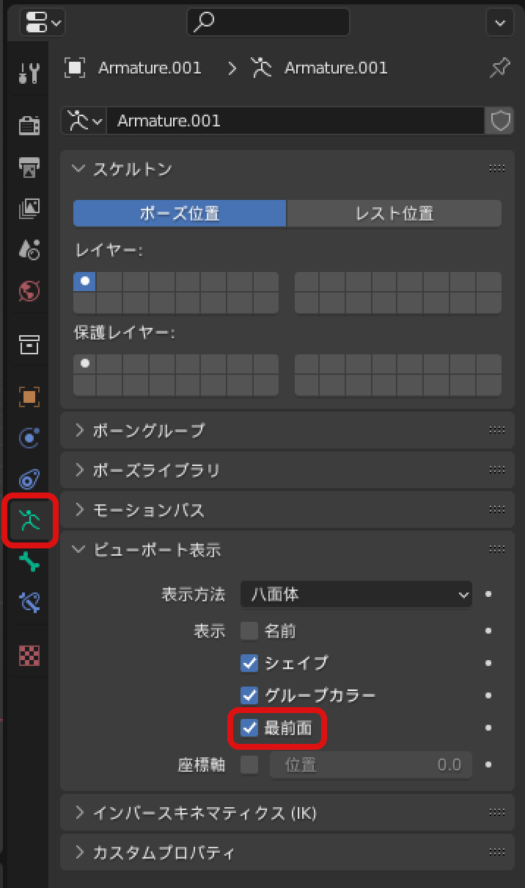

アーマチュアを選択して、アーマチュアの**編集モードに切り替え**ましょう。メッシュの編集モードと同様に、ボーンを操作することができます。下図のように、体の中心にボーンを移動させてください。

さらに、手足や頭の変形のためにボーンを追加します。アーマチュアの編集モードになっていることを確認し、体中央のボーンの先端のジョイント(球の部分)を選択してください。

この状態で左のツール一覧から**押し出し**ツールを選択します。

すると、メッシュの編集時の押し出しツールと同じマニピュレータが出てきます。

メッシュの時と同様に、白い円をドラッグすることで新たなボーンを作成することができます。これを使って、まず背骨先端から肩に向かって伸びるボーンを作成しましょう。

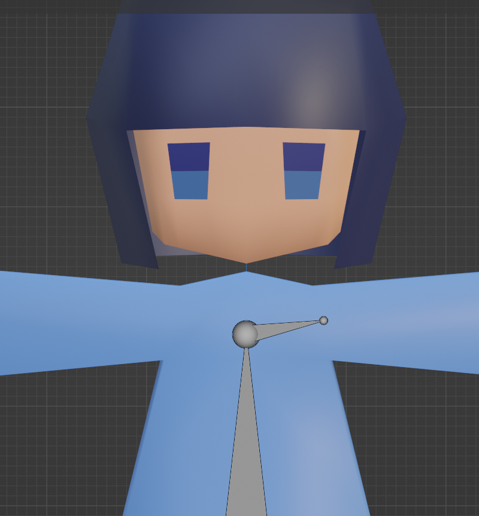

次に、肩からボーンを押し出して、腕の中心をとおる位置にボーンを追加しましょう。

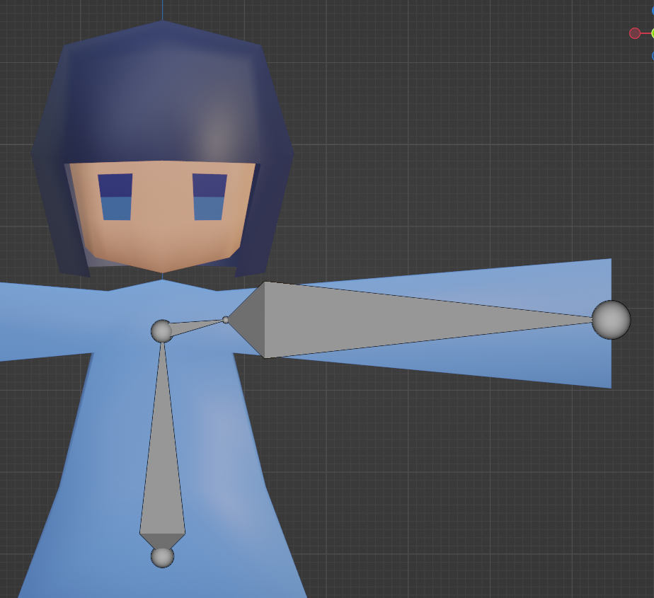

これを繰り返し、体中心のボーンから押し出して作ったボーンで両手足と頭の位置にボーンを設置してください。

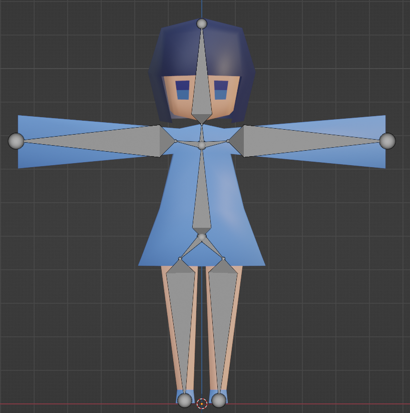

↑こんな感じになっていればOK

## スキンウェイトの設定

次に、スキンウェイトの設定を行います。今回は自動でウェイト調整してくれる機能を用います。

まずオブジェクトモードに戻り、モデルのメッシュだけを選択してください。

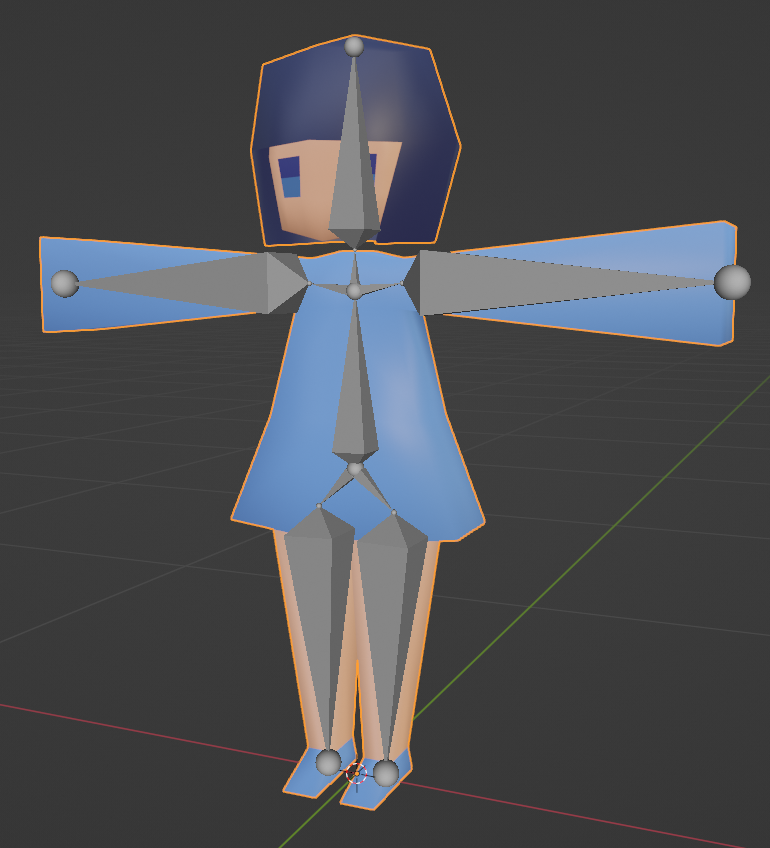

次に、**メッシュを選択したまま**、<kbd>shift</kbd>+左クリックでアーマチュアも選択してください。下図のようにアーマチュアがオレンジ、メッシュが濃いオレンジになっていればOK。

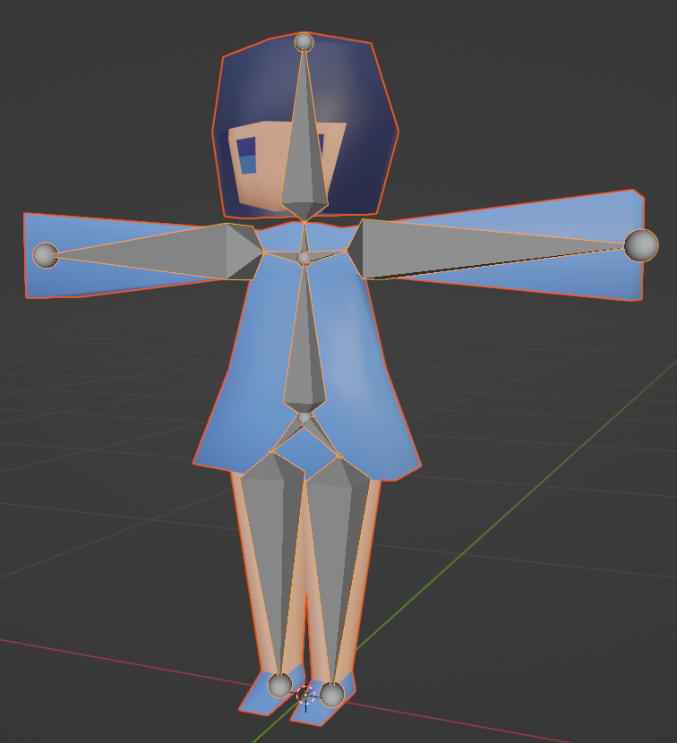

この状態で左上のメニューから"オブジェクト"→"ペアレント"→"自動のウェイトで"を選択してください。これにより、メッシュがアーマチュアに追従する用設定されます。

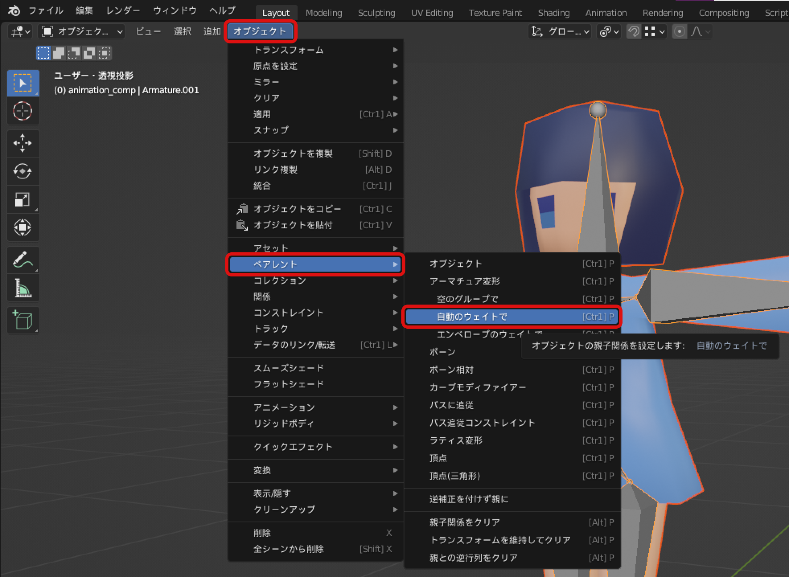

## ポーズ作成

モデルとアーマチュアを結びつけることができたので、次にポーズを設定します。
オブジェクトモードで**アーマチュアを選択し**、**ポーズモード**に切り替えます。

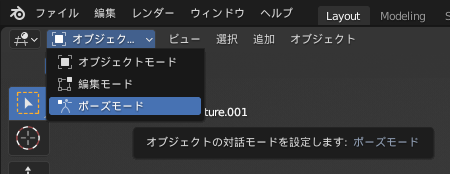

この状態でボーンの移動や回転をすると、モデルを変形させることができます。

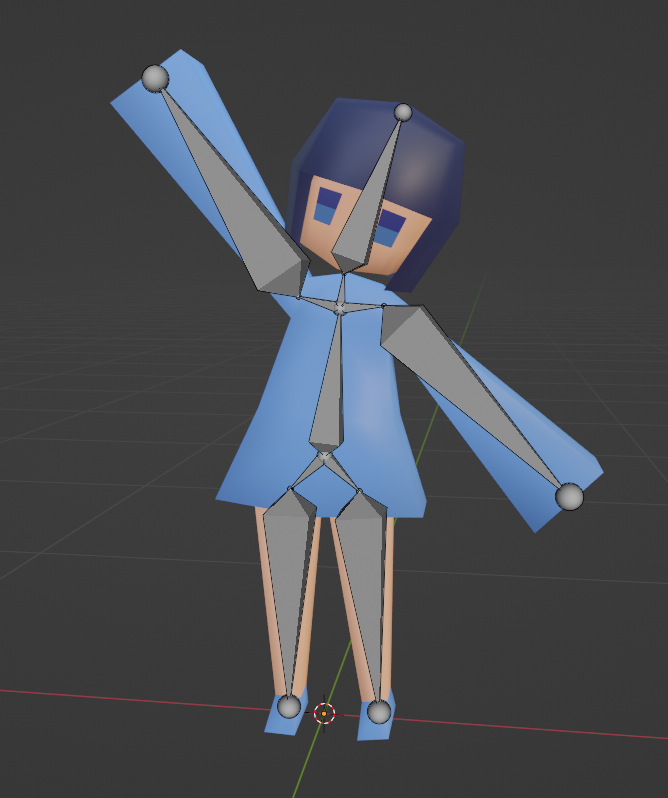

変形をリセットしたい場合、リセットしたいボーンを選択した状態で"ポーズ"→"トランスフォームをクリア"から、位置や回転をリセットすることができます。

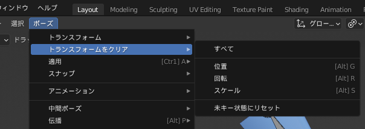

## キーフレームの作成

ここからは、実際にアニメーションを作成していきます。

まず、キーフレームを作成するために**タイムライン**パネルを広げます。タイムラインパネルは画面下部に存在します。ビューポートとの境界線にマウスを重ね、矢印が出たらドラッグして領域を広げることができます。

これでキーフレームを作成する準備ができました。
まず、**タイムラインの青いバーを0フレーム目に合わせてください**。

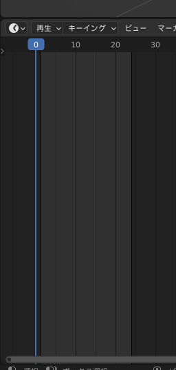

これが「今から0フレーム目を編集するよ」という印です。

**この状態で**アーマチュアの**ポーズモード**に移り、自由にポーズを作ってください。

ポーズができたらボーンを**全選択**(<kbd>A</kbd>)し、左上のメニューから"ポーズ"→"アニメーション"→"キーフレームを挿入..."を選択して**キーフレームの挿入**を行います。  
(ショートカットキーとして、**<kbd>I</kbd>を押してキーフレームの挿入**を行うこともできます。)

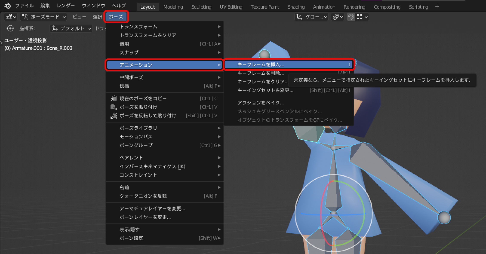

キーフレームの挿入を選択すると、"キーフレーム挿入メニュー"というメニューが表示されます。これは、選択したアイテムのどの要素をキーフレームとして登録するかを選ぶメニューです。

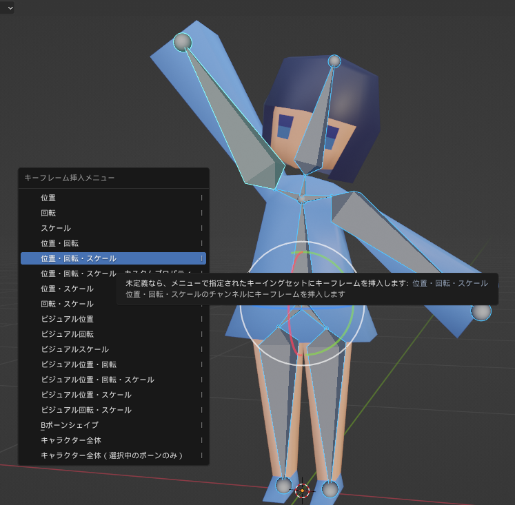

メニューの"位置・回転・スケール"を選択すると、選択したボーンの位置・回転・スケールがキーフレームとして0フレーム目に挿入されます。

キーフレームが挿入された印として、タイムラインに黄色のひし形が表示されます。

タイムラインのバーを動かして別のフレームに移動→そのフレームでのポーズを設定→...
を繰り返すことでアニメーションを作成していきます。自分の好きなフレームで、好きなポーズをキーフレームとして設定してみましょう。

## アニメーションの長さの設定

プロパティパネルの**出力プロパティ**で、出力の設定をすることができます。プリンターのようなアイコンで示されています。

アニメーションの秒数は、"フレーム範囲"内の終了フレームの指定により変更できます。1秒間に24フレーム用いるので、5秒の動画にしたい場合は24×5=120フレームに設定してください。今回私は1秒間の短いループ動画にしたいので、終了を24に設定しました。

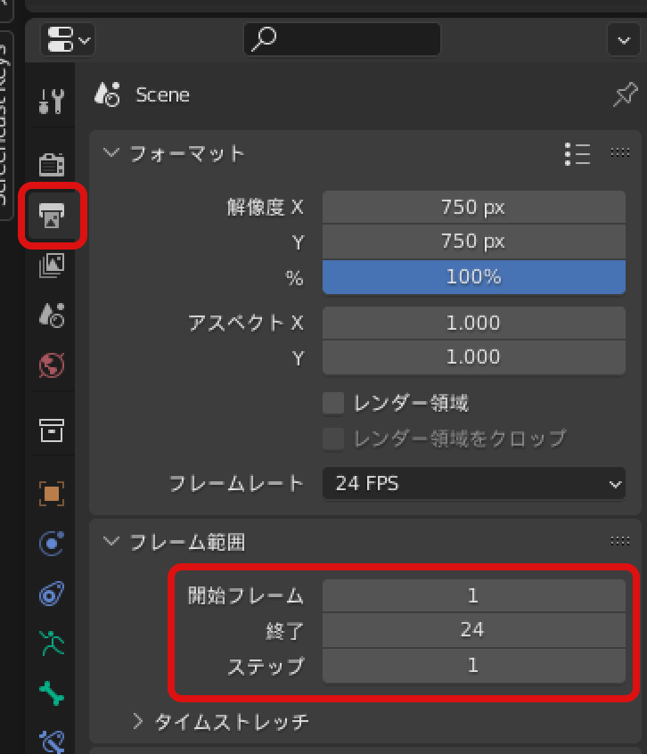

例えば、0フレーム目で片腕を上げ、12フレーム目で腕を下げ、24フレーム目にまた腕を上げるポーズを取らせる(3つのキーフレームを挿入する)ことで、手を振るアニメーションができます。

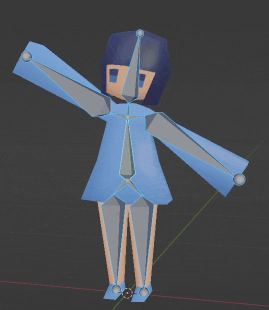

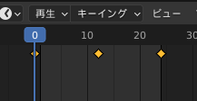

:::
