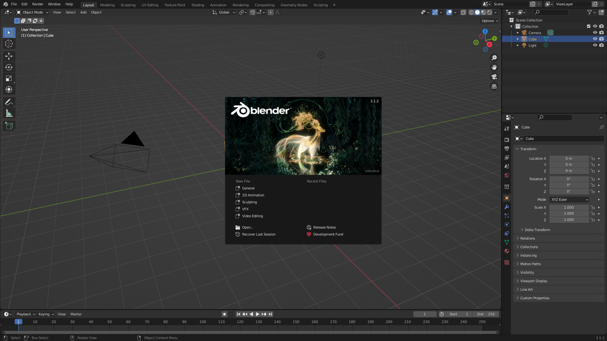
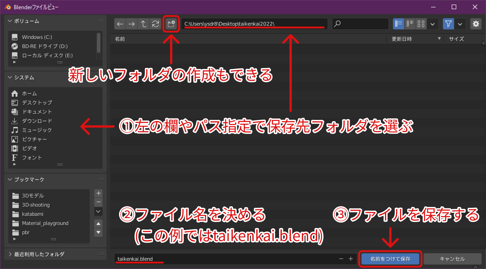

# Blenderの基本設定・基本操作

まずはBlenderの基本設定・基本操作を説明します。

## Blenderとは

公式サイト：<https://www.blender.org/>  
公式紹介：<https://www.blender.org/about/>

> Blender is the free and open source 3D creation suite. It supports the entirety of the 3D pipeline—modeling, rigging, animation, simulation, rendering, compositing and motion tracking, even video editing and game creation.
> 引用：<https://www.blender.org/about/>

## Blenderのインストール

[Blenderのインストール・日本語化](../guide/blender-installation.html)を参考に、**インストール**と**日本語化**を済ませてください。

インストール出来たらBlenderを起動します。  
起動したら次のような画面になります。↓

真ん中の↓これ↓はスプラッシュスクリーンと呼ばれるもの。

Blenderからの「こんにちは」です。(参考：[Splash Screen(スプラッシュ画面) — Blender Manual](https://docs.blender.org/manual/ja/3.1/interface/window_system/splash.html))

この画面の右上に表示されている数字が、今利用しているBlenderのバージョン情報です。この実習では**2.8以上**(2.9や、3.0.1など)になっていれば大丈夫。なお、現在の最新版は<blenderVersion />です。

また、バージョン番号は画面右下のステータスバーにも表示されています。

:::training
バージョンが確認出来たらスプラッシュスクリーンの**外側を**クリックしてスプラッシュスクリーンを消しましょう。
:::

## Blenderの日本語化

[Blenderのインストール・日本語化](../guide/blender-installation.html)を参考に、**インストール**と**日本語化**を済ませてください。

## Blenderの画面構成

起動直後のBlenderの画面構成は以下のようになっています。

- **3Dビューポート**でモノの**操作**を行う
- **アウトライナー**でモノの**管理**を行う
- **プロパティ**でモノの**設定**を行う
- **タイムライン**で**時間操作**を行う

といった感じです。

参考：[デフォルトのワークスペース — Blender Manual](https://docs.blender.org/manual/ja/3.1/interface/window_system/workspaces.html#default-workspaces)

## ファイルの保存

最初に今回の作業データの保存場所の設定を行いましょう。
Blenderは作業途中のデータをまるまる`.blend`の形式で保存します。

`.blend`の保存は、特定の3Dモデルやアニメーションを保存するのではなく、**作業途中のデータを作業机ごと保存しておくイメージ**です。

参考：[Assets, Files, & Data System » はじめに — Blender Manual](https://docs.blender.org/manual/ja/3.1/files/introduction.html), [Opening & Saving — Blender Manual](https://docs.blender.org/manual/ja/3.1/files/blend/open_save.html#saving-files)

:::tip
3Dモデルやアニメーションのデータを、**ゲーム制作等で使用するために保存する場合**は別の操作が必要になります。
:::

:::training

### ファイルの保存をしよう

まず、画面左上の"**ファイル**→**名前を付けて保存**"を選択してください。

するとファイル保存用のウィンドウが開くので、下の画像に従って`.blend`ファイルを保存してください。

1. 左の欄から好きなフォルダを選ぶ。この例ではデスクトップの`taikenkai`フォルダを選択
2. ファイル名を画面下部の入力欄に入力する
3. 画面下部の"名前つけて"保存を押して保存する

:::

以降、**適宜作業がひと段落つくたびにファイルの保存をするようにしましょう**。画面左上の"ファイル"→"保存"でも保存できますし、Windowsなら<kbd>Ctrl</kbd> + <kbd>S</kbd>、Macなら<kbd>⌘command</kbd> + <kbd>S</kbd>でも保存できます

## 3Dビューポートでの視点移動

まずは視点移動の練習をします。

- マウスの中ボタン(ホイール、くるくる回るやつ)を押しながらマウスを動かすと、視点を上下左右に回転できます。  
  
- <kbd>Shift</kbd>を押した後に、マウスの中ボタンを押しつつマウスを動かすと、上下左右に視点を平行移動できます。  
  
- マウスのスクロールで、画面のズームイン/ズームアウトができます。  
  
- <kbd>Alt</kbd>を押しながら中ボタンドラッグをすると、真正面、真横、真上等からの視点になります。

参考：[Navigation(視点の操作) — Blender Manual](https://docs.blender.org/manual/ja/3.1/editors/3dview/navigate/navigation.html)

:::training

### Blenderの視点操作に慣れよう

上に挙げた四つの視点操作を全て試してみてください。慣れるまでぐりぐり動かしてみましょう。

:::

## オブジェクトモードと編集モード

デフォルトでは画面の中央に立方体が置いてあるはずです。Blenderでは、以下の操作を繰り返してモデリングを行います。

1. オブジェクトモードで単純な**図形を設置**する
2. 編集モードで**複雑な形に変形**させる

参考：[シーン & オブジェクト » Objects(オブジェクト) » はじめに — Blender Manual](https://docs.blender.org/manual/ja/3.1/scene_layout/object/introduction.html), [Modeling(モデリング) » はじめに — Blender Manual](https://docs.blender.org/manual/ja/3.1/modeling/introduction.html)

Blenderには、この2操作に対応する"モード"が存在します。

- **オブジェクトモード**
  - オブジェクト自体の配置や移動、追加を行うモードです。
- **編集モード**
  - 1つのオブジェクトの頂点や辺、面の配置や移動を行うモードです。

これら2つのモードは画面左上から切り替えることができます。<kbd>Tab</kbd>を押すことでも切り替えることができます。

これら2つ以外にも、そのオブジェクトに対応したモードが複数存在します。

参考：[オブジェクトのモード — Blender Manual](https://docs.blender.org/manual/ja/3.1/editors/3dview/modes.html)

## オブジェクトモードでの基本操作

> Blenderでは、以下の操作を繰り返してモデリングを行います。
>
> 1. オブジェクトモードで単純な図形を設置する
> 2. 編集モードで複雑な形に変形させる

まずは1.の"オブジェクトモードで単純な図形を設置する"の方法を確認しましょう。

### オブジェクトモードでのオブジェクト選択

オブジェクトモードでは、**左クリック**でオブジェクトの**選択**ができます。選択できると、オブジェクトの周りがオレンジの線で縁取られます。

参考：[選択 — Blender Manual](https://docs.blender.org/manual/ja/3.1/scene_layout/object/selecting.html)

### オブジェクトモードでのオブジェクト削除

オブジェクトを選択した状態で<kbd>X</kbd>を押すと、**オブジェクトの削除**を行うことができます。確認ダイアログが出るので、OKを押すことで削除できます。<kbd>Delete</kbd>でも削除することができます。

参考：[Delete(削除) — Blender Manual](https://docs.blender.org/manual/ja/3.1/scene_layout/object/editing/delete.html)

:::training

#### オブジェクトを削除しよう

**最初から表示されている立方体**を削除してみましょう。

1. **オブジェクトモード**になっていることを確認し、
2. 立方体にカーソルを合わせて、
3. **右クリック**して選択し、
4. <kbd>X</kbd>または<kbd>Delete</kbd>で削除

:::

### オブジェクトモードでのオブジェクト追加

オブジェクトモードでは左上の"**追加**"を選択することで、オブジェクトの追加ができます。

"メッシュ"、"カーブ"、"サーフェス"...等さまざまなオブジェクトを追加できます。

参考：[オブジェクトの種類 — Blender Manual](https://docs.blender.org/manual/ja/3.1/scene_layout/object/types.html)

:::training

#### 立方体を追加しよう

一度削除しましたが、再度立方体を追加しましょう。
立方体は"追加"→"メッシュ"→"立方体"から選択することができます。

:::

## 編集モードでの基本操作

> Blenderでは、以下の操作を繰り返してモデリングを行います。
>
> 1. オブジェクトモードで単純な図形を設置する
> 2. 編集モードで複雑な形に変形させる

ここからは2.の"編集モードで複雑な形に変形させる"方法を確認しましょう。

まず**オブジェクトモードで**"編集したいオブジェクト"を選択し、そのあと編集モードへ切替えます。

すると、選択したオブジェクトの編集モードに移ることができます。

:::training

立方体を再度選択してください。オレンジで縁取られていれば選択できています。この状態で、編集モードに切り替えてください。すると下のような画面になるはずです。

立方体の様子が変わって、立方体の編集モードになりました。

:::

:::tip
Blenderでは、ボタンや数値の入力ボックスなど、クリックで選択できる要素にマウスカーソルを重ねるとその説明を表示できます。よくわからないボタンがあったら、ひとまずクリックせずに説明を読んでみましょう
:::

### 編集モードでの選択

編集モードでは、**左クリック**によりオブジェクトのこまかなパーツの**選択**ができるようになります。
選択されたパーツは白またはオレンジ色になります。

何を選択できるかは画面左上で選択でき、それぞれ左から頂点、辺、面を選択できるようになります。(数字キーの<kbd>1</kbd>、<kbd>2</kbd>、<kbd>3</kbd>を押すことでもそれぞれ切り替えることができます)

<kbd>Shift</kbd>+左クリック で**複数選択**できます。

<kbd>A</kbd>を押すとそのオブジェクト内の頂点等を**全選択**できます。二連続で押すと、**全選択解除**出来ます。

<kbd>Ctrl</kbd>+<kbd>L</kbd>(Macなら<kbd>⌘command</kbd>+<kbd>L</kbd>)で、現在選択しているものと**繋がっているもの**を全て選択できます(リンク(Link)選択)

### 編集モードでの削除

### 編集モードでの追加

## 取り消しとやり直し

<kbd>Ctrl</kbd>+<kbd>Z</kbd>を押すと、**今行った操作を取り消す**ことができます。モデリングに限らず、多くのソフトウェアでこのショートカットキーが使えるはずなので**絶対に覚えてください**。

<kbd>Ctrl</kbd>+<kbd>Shift</kbd>+<kbd>Z</kbd>を押すと、**取り消した操作をやり直す**ことができます。「取り消しすぎちゃった...」ってときに使いましょう。

## 編集モードのツール

編集モードでは、画面左に**ツール一覧**が表示されます。

もし表示されていない場合は、画面左端上方にある小さな三角マークをクリックするか、<kbd>T</kbd>を押すことで表示できます。

ツール一覧は<kbd>T</kbd>を押すと表示/非表示が切り替わるので、見つからなかったり、消えてしまっても慌てずに<kbd>T</kbd>を押してください。

ツール一覧が表示してあるとこうなっているはず

ここでは特に重要なツールの紹介をします。これらは今回の実習ではもちろん、通常の制作でもよく使うことになるので覚えておいてください。

### 選択

ツール一覧の一番上のマークをクリックすると、選択ツールになります。これは先ほど説明した、モノの選択ができるツールです。

マークを長押しすることで、**ボックス選択**やサークル選択等を切り替えることができますが、今回はボックス選択を使うことをお勧めします。

### 移動

十字の矢印のマークは**移動**ツールです。選択した頂点や辺、面を移動させることができます。移動ツールを選んだまま頂点等の選択も可能です。

下の画像は移動ツールで立方体の頂点を選択している状態です。

画面に表示された赤・青・緑の矢印をドラッグすることで、その矢印に沿って選択物の移動ができます。
この赤青緑は"**マニピュレータ**"と呼びます。

白い円をドラッグすることでも選択物の移動ができます。この場合、矢印に沿った移動ではなく自由に移動できます。

<kbd>G</kbd>を押すことでも、選択物の移動ができます(Grabの頭文字)。この場合は、左クリックで移動を確定します。

移動の途中で<kbd>Shift</kbd>を押すと、**ゆっくり移動**させることができます。細かい調整がしたい場合は活用してみてください。

### 回転

いかにも回転させそうなマークは**回転**ツールです。選択した辺または面を回転させることができます。移動ツールと同様に、マニピュレータで軸に沿った回転、白い円のドラッグで自由に回転できます。

<kbd>R</kbd>を押すことでも、選択物の移動ができます(Rotateの頭文字)。この場合は、左クリックで回転を確定します。

こちらも、回転の途中で<kbd>Shift</kbd>を押すと、ゆっくり回転させることができます。

### スケール

**スケール**ツールを使うと、選択物の大きさを変えることができます。これも、マニピュレータで軸に沿った拡縮、白い円のドラッグで自由に拡縮できます。

<kbd>S</kbd>を押すことでも、選択物の移動ができます(Scaleの頭文字)。この場合は、左クリックで拡縮を確定します。

こちらも、拡縮の途中で<kbd>Shift</kbd>を押すと、ゆっくり拡縮させることができます。

:::training

### 移動・回転・スケールの操作に慣れよう

立方体の頂点や辺、面を移動/回転/拡縮して変形させてみよう。変形した立方体はこの後の実習で使わないので自由に変形してとにかく操作に慣れよう。
:::
