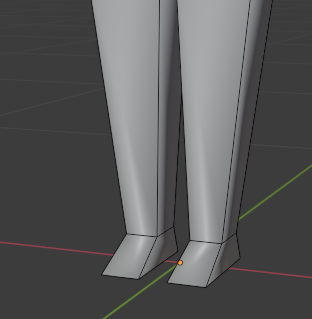
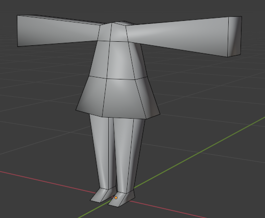
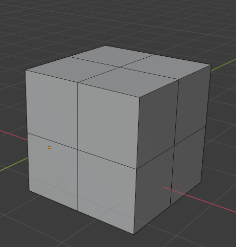
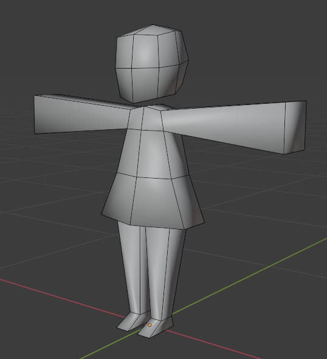
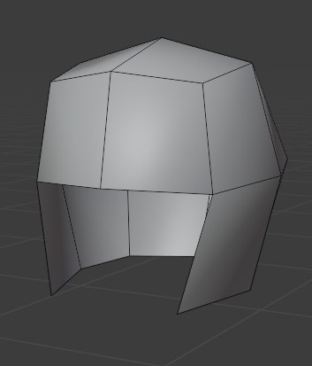
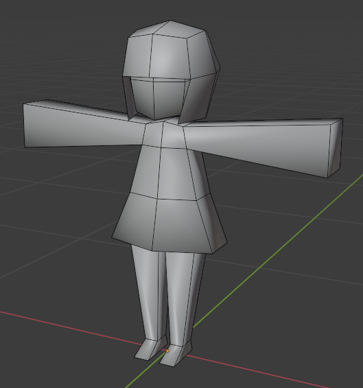
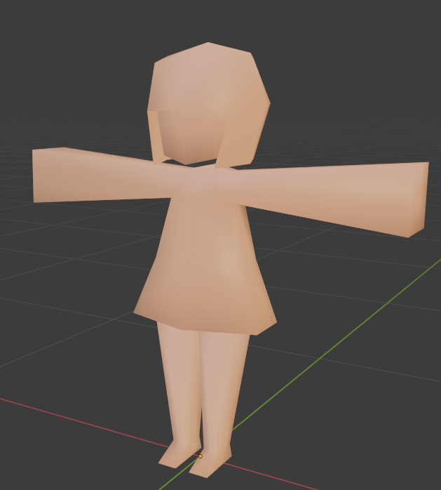
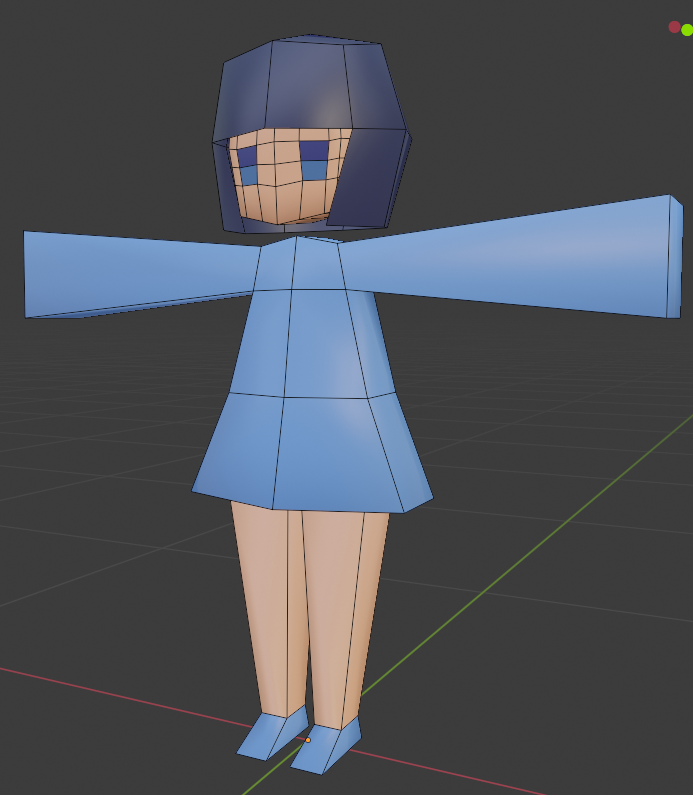

# キャラクターモデルの作成

ここからいよいよ今回の目標であるキャラクターモデルの作成に取り掛かります。ここからずっと作業と説明同時進行です。

## ポリゴンメッシュの作成

:::training
まず、先ほどまでいじっていた立方体だったものは削除してしまいましょう。**一度オブジェクトモードに戻り**、立方体だったものを選択して、<kbd>X</kbd>で削除です。

そしてまた新たにキャラクターモデルのもととなる立方体を追加します。**オブジェクトモードで**"追加"→"メッシュ"→"立方体"でしたね。

追加した立方体を選択して編集モードに切り替えてください。

また、ここからはこまめな保存を心掛けましょう。忘れる前に<kbd>Ctrl</kbd>+<kbd>S</kbd>。

今回作るのは人型のモデルです。最低限必要なパーツは頭・体・両足の4つのパーツです。
最終的なイメージはこんな感じです。

↓斜めから見た図

↓正面から見た図

↓真横から見た図

↓斜め後ろから見た図

もちろん、完璧にこの通りにする必要はありませんし、各自でアレンジしていただいても構いません。猫耳生やすとか、服の形を変えるとか。

まずは体を作りましょう。追加した立方体全体を選択し(全選択は<kbd>A</kbd>)、縦に細長くなるように拡縮します。また、体を少し上に(青い矢印の方向)移動させます。

ここで、下のグリッドに注目してください。このグリッドはオブジェクトが置かれる世界の目印です。ここが床になるとして、足を作ったときにちょうどいい高さになるよう体を上に移動させました。

次に、腕部分を作成します。ここで使うのが**ループカット**と**押し出し**です。

### ループカット

**ループカット**を使うと、繋がったポリゴンを**きれいに分割する辺を作成**することができます。ループカットを**選択した状態でカーソルをポリゴンに重ねる**と、下図の様な補助線が表示されます。この補助線方向の辺を追加することができます。今回は横にループ状の辺を作成したいので、下図の向きに補助線が表示されるようカーソルを重ね、**左クリック**します。

すると、挿入する辺の位置を調整することができるので、**マウスを動かして位置を調整**します。胸～脇の下のラインを作りたいので、上1/3程度の位置で**もう一度左クリックして確定**させます。

この後も辺を追加する場合は、このループカットを使って作業すると便利です。

なお、このループカットは<kbd>Ctrl</kbd> + <kbd>R</kbd>のショートカットキーでも使うことができます。

詳細：[Loop Cut(ループカット) — Blender Manual](https://docs.blender.org/manual/ja/3.1/modeling/meshes/tools/loop.html)

### 押し出し

**押し出し**ツールを使うと、頂点や辺、面から**新たな辺や面を押し出して作成**することができます。

詳細：[Extrude Region(押し出し（領域）) — Blender Manual](https://docs.blender.org/manual/ja/3.1/modeling/meshes/tools/extrude_region.html)

言葉での説明が難しいので一度試してみましょう。

まず、**"面"の選択モードに切り替えて**、下図の面を選択してください。

その後、ツール一覧から押し出しツールを選択すると、下図のような表示に切り替わります。

この状態で"＋"のマークを**ドラッグ**すると...

このように、選択した面から新たな面をにょきっと押し出すように作成することができます。今回はこの押し出した部分を片腕としますので、反対側の面でも同様に、同じくらいの長さだけ押し出してください。

このようになっていればOK

### 足、頭の追加

編集モードで新たに立方体を追加して、頭と足を作成しましょう。

"追加"→"メッシュ"→"立方体"で立方体を追加して...

拡縮と移動を組み合わせて片足を作り、体部分に下から差し込むような位置に配置します。
このままでは重なった部分が見づらいので、画面右上の**透過表示切替ボタン**を押して、メッシュを半透明にしましょう。

↑体と足が重なった部分も見えるようになりました。この段階ではまだおおざっぱな位置関係だけあっていれば大丈夫です。最後に調整します。

↑同様の作業を繰り返し、両足を作成してみてください。

↑頭の位置にも立方体を追加し、頭を作りましょう。

これでパーツが揃いました。...が、このままでは少し不格好なので、移動・回転・拡縮・ループカットによる辺の追加を駆使して形を整えましょう。この工程が一番難しく、また、人によって好み等で差が出る部分です。今回はヒトの形でしたらどのように変形しても構いません。難しいと感じる人は、この資料の通りの変形を目指してみてください。

↑足首の辺りにループカットで辺を追加し、形を整えました。

↑体のサイズを調整し、おなかにループカットで辺を作ってワンピース風にしました。

↑頭に3回、各方向からループカットで辺を作り...

↑丸みを帯びた形にしました

↑頭と同じ形のメッシュをもう一つ作り、一部を削除することで...

↑髪の毛を作りました。

## マテリアルの設定

メッシュが完成したら、次はマテリアルで色を設定します。

右上のこのマークをクリックして、マテリアルプレビューモードに切り替えましょう。
このモードではマテリアルの見え方を確認しながらモデリングを進めることができます。

早速マテリアルを設定して行きましょう。

**編集モードのまま**、画面右下の**プロパティ**パネルの中で、**マテリアルプロパティ**のタブを開いてください。下の方の赤い球のマークです。

デフォルトでは、"Material"という名前のマテリアルがセットされているはずです。

もしマテリアルが何も設定されていない場合、下図のようになっています。その場合は、"新規"を押してマテリアルを追加しましょう。

このマテリアルの"サーフェス"のメニュー中の"ベースカラー"を変更すると、メッシュの色を変えることができます。

ここでは肌色にしてみました。

さらに別の色を加えるには、**別のマテリアルを新たに作成**する必要があります。
まず、下の画像に示している"＋"を押して、新たな**マテリアルスロット**を作成します。
マテリアルスロットは、マテリアルを複数設定するための入れ物のようなものです。

空白のスロットを選択した状態で"+新規"を押すことでマテリアルを追加することができます。

新しいマテリアルを追加し、"ベースカラー"を青色に設定してみました...が、全ての面に、最初に作成したマテリアル(肌色)だけが適用されています。Blenderでは、各面ごとにマテリアルを割り振ることができるので、以下の手順でマテリアルの割り振りを行いましょう。

1. モデルを選択して**編集モード**に移り、マテリアルを割り振りたい**面**を選択します。  
2. **選択した面に適用したいマテリアル**を**プロパティから選択**します。  
3. そのマテリアルで"**割り当て**"を選択する

これにより、選択した面に選択したマテリアルを割り当てることができます。

これを用いて、数種類のマテリアルを用意し、服や靴などマテリアルを分けて色を変えてみましょう。

肌、服、髪を色で区別してみました。また、目の部分に新たに辺を作成し、目の色を設定してみました。
