# 画像・映像の出力(レンダリング)

最後に、作成したアニメーションを動画ファイルとして出力してみましょう。

:::training

## 出力設定

プロパティパネルの**出力プロパティ**で、出力の設定をすることができます。まず、出力動画の解像度を設定しましょう。解像度は、画像のサイズのことだと思っていただいて構いません。

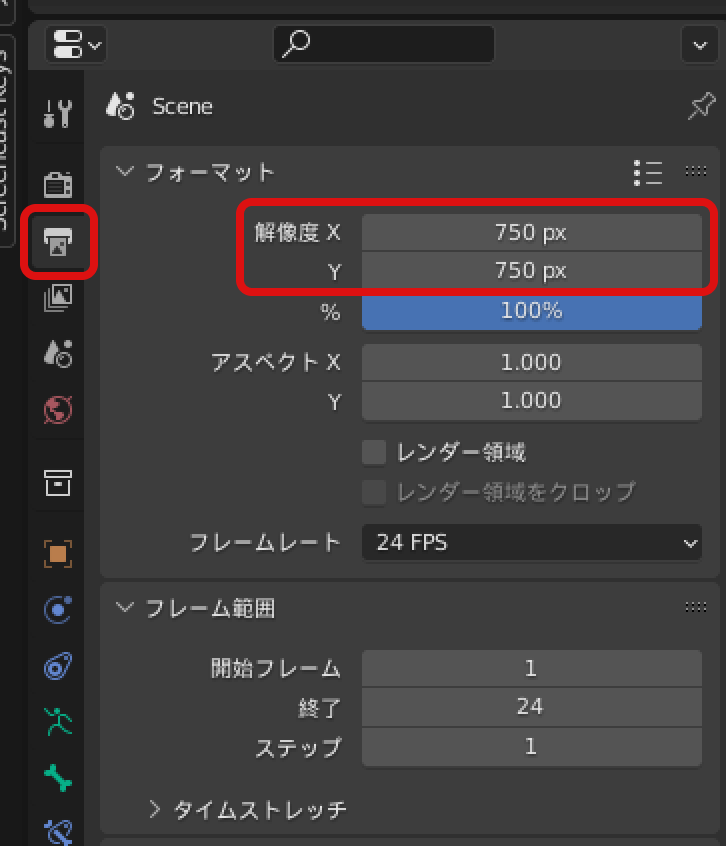

この例では、750px四方の正方形にしています。

## カメラの設定

オブジェクトモードに戻り、カメラの設定をします。デフォルトでカメラが追加されているはずですが、もしカメラを消してしまっていた場合、"追加"→"カメラ"でカメラを追加してください。

カメラは以下のような見た目をしています。三角形がついている方が上方向を表しています。

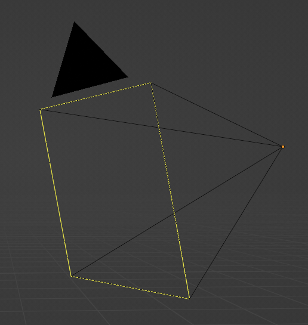

メッシュの編集モード同様にカメラの移動・回転が可能です。モデルが画角に収まるように位置・角度を調整してください。

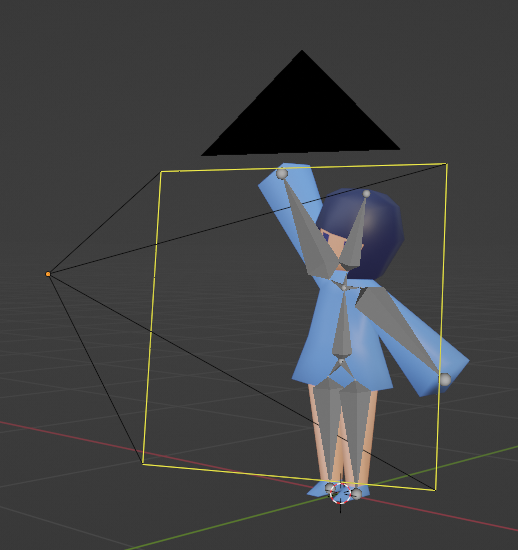

また、カメラからの見た目がどうなっているかは、テンキーの<kbd>0</kbd>、または"ビュー"→"視点"→"カメラ"で確認できます。

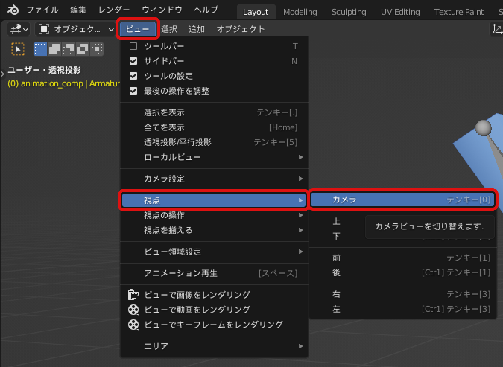

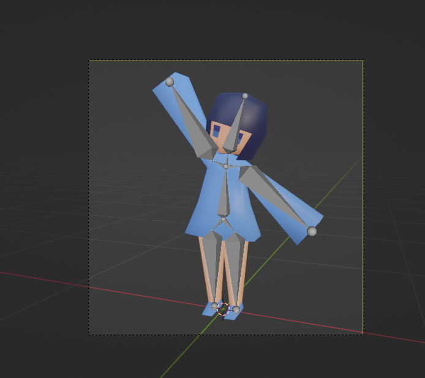

↑カメラからの見た目

## 画像のレンダリング

カメラ位置の調整が済んだら、画像のレンダリングをしてみましょう。画面左上の"レンダー"→"画像をレンダリング"で画像をレンダリングすることができます。

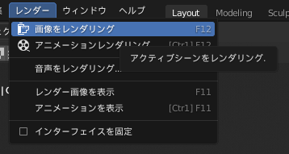

するとレンダーのウィンドウが開き、レンダリング結果が表示されます。この画像は左上の"画像"→"名前を付けて保存"で保存できます。保存出来たら進捗チャンネルに画像を共有してみましょう:sparkles:

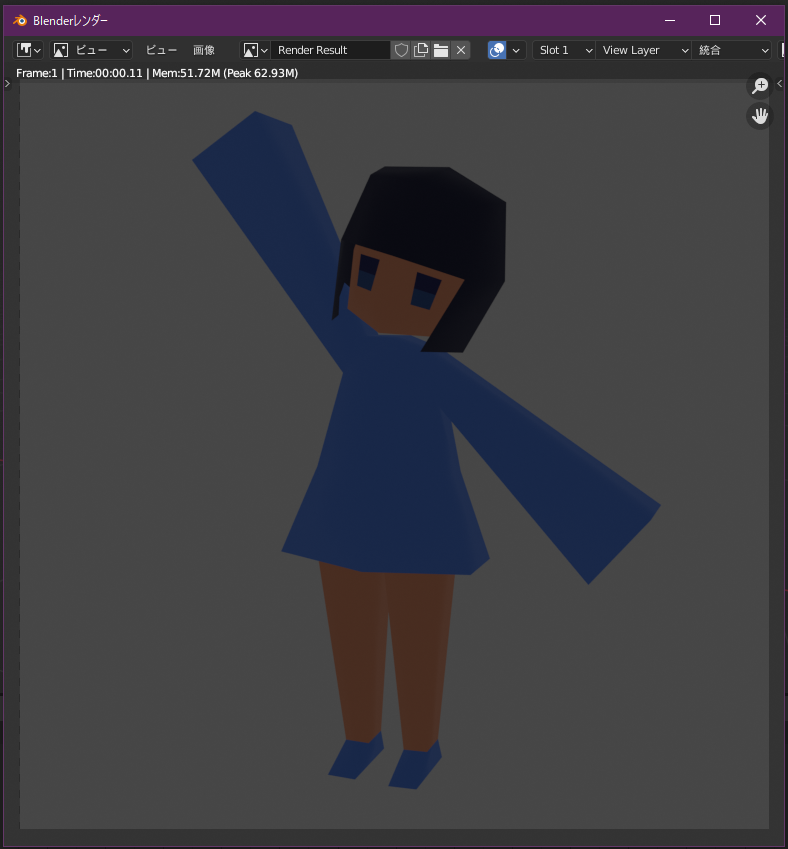

## ライトの設定

レンダリング結果が暗すぎたり、逆に明るすぎた場合はライトの設定を変更しましょう。上の例は暗すぎますね。ライトは↓下図の様な丸い奴↓。ライトはデフォルトで存在しているはずです。

もしライトを消してしまっていたら、オブジェクトモードで"追加"→"ライト"→"ポイント"でライトを追加することができます。

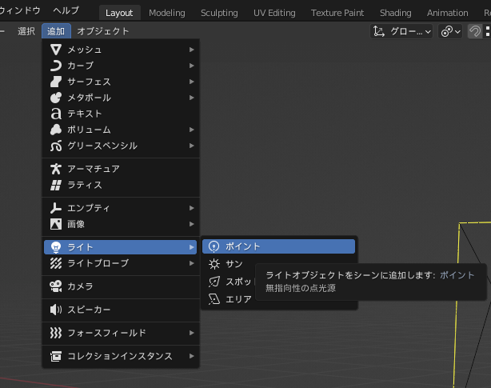

ライトの位置を変え、適切な明るさになるよう調整してください。

ライトのパワーや色は、**ライトを選択した状態で**プロパティパネルに表示される設定画面から変更することができます。

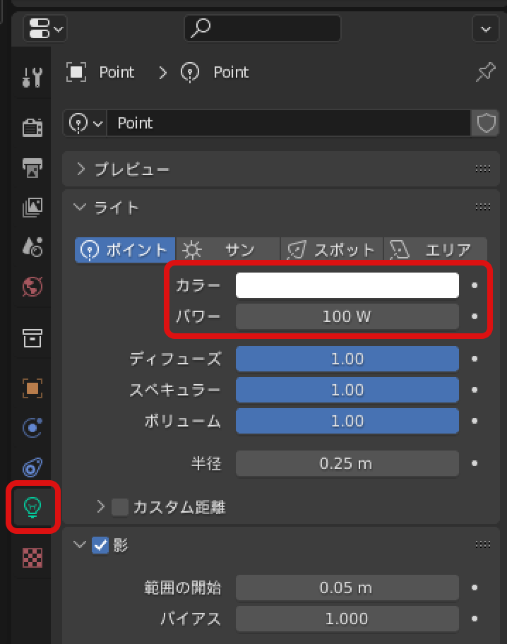

また、画面右上の↓このマーク↓をクリックすると、**レンダープレビュー**モードに切り替えることができます。このモードでは、レンダリング結果を**リアルタイムで確認することができます**。見た目の調整はこのモードで行いましょう。

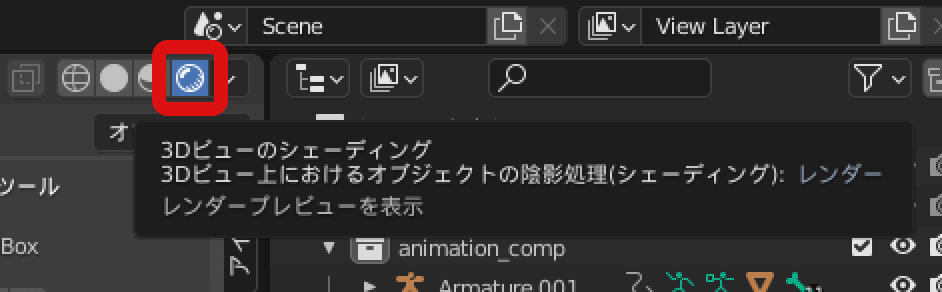

## 動画の出力設定

最後に、動画出力用の設定をします。レンダープロパティの"出力"を変更します。まず、出力する動画の保存先を指定します。次に"ファイルフォーマット"以下を以下の通りに設定してください。

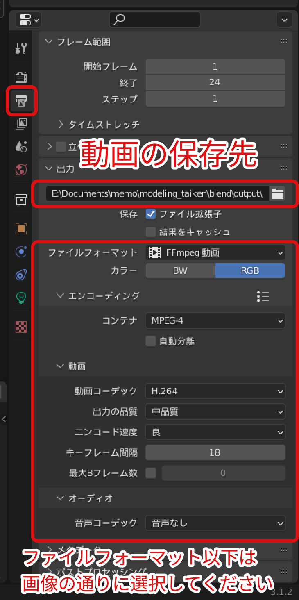

- ファイルフォーマット：FFmpeg動画
- カラー：RGB
- エンコーディング
  - コンテナ：MPEG-4
  - 動画
    - 動画コーデック：H.264
    - 出力の品質：中品質
    - エンコード速度：良
    - キーフレーム間隔：18
  - オーディオ
    - 音声コーデック：音声無し

この状態で"レンダー"→"アニメーションをレンダリング"を選択すると、アニメーションを出力することができます。保存フォルダを確認すると、"○○.mp4"のファイルがあるはずです。

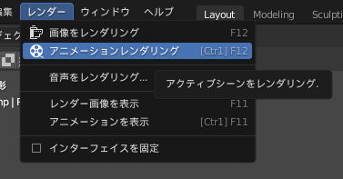

以上でアニメーションの出力が完了です。お疲れさまでした！ぜひTwitterや進捗チャンネルに投稿しましょう！

:::
